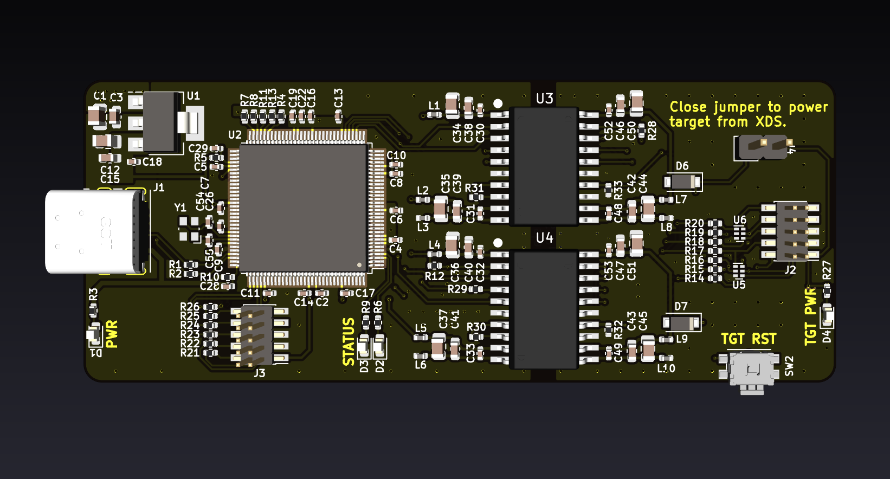
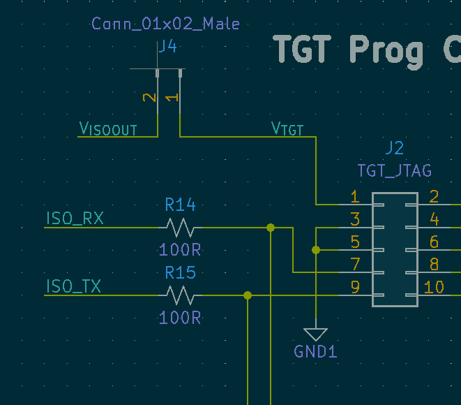

<p align="center">
  <h1 align="center">Isolated TI XDS Programmer</h1>
  <p align="center">
    Isolated TI & CMSIS-DAP Compatible Debugger/Programmer
  </p>
</p>

<br />
<p align="center">
    
<p/>

[](https://creativecommons.org/licenses/by/4.0/)

## Usage 💻
The programmer supports SWD, JTAG and cJTAG (2-wire JTAG). In addition to the programming interface, a UART connection is available over two unused pins of the 10pin programming header. These UART pins are connected back to the programmer and are available over the USB host connection as a CDC Serial port. This is useful for sending debug messages, logging and other application data from the target. The programmer also has a side fire push button that can be used for reseting the target device, as well as a jumper to supply power to the target. This is not to act as a substitution for target power, but rather a means to power and program the target micro without applying power to the entire target board.

#### CDC Serial Port
To connect the XDS serial lines to your targets UART, please reference the 10pin ARM header pinout below. The current design assumes that you are creating your target hardware and have the ability to route your UART pins to the "unused" pins of the programming header.

**```NOTE - The UART switching for TX<->RX and RX<->TX is done for you on the XDS hardware. The target TX pin sould go to pin 9 of the 10pin ARM header.```**



## Development ⚡
The Isoalted XDS hardware is currently developed in the open source ECAD software [KiCAD](https://www.kicad.org/). The board was created using as many of the included component symbols and footprints as possible.